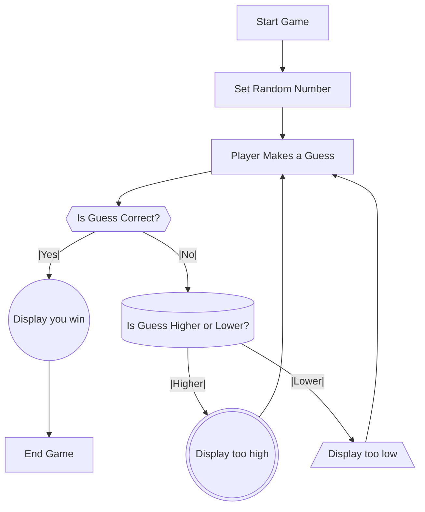

```mermaid
flowchart TD
    A[Start Game] --> B[Set Random Number]
    B --> C[Player Makes a Guess]
    C --> D{{Is Guess Correct?}}

    D -- |Yes| --> E((Display you win))
    D -- |No| --> F[(Is Guess Higher or Lower?)]

    F -- |Higher| --> G(((Display too high)))
    F -- |Lower| --> H[/Display too low\]
    G --> C
    H --> C
    E --> I[End Game]
```
